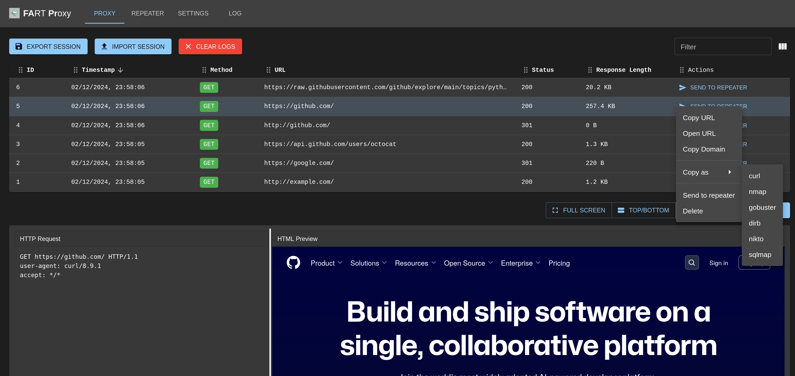

# FART (Fast API Request Tool) Proxy



FART is a Man-in-the-Middle (MITM) proxy tool built with mitmproxy as the backend and React.js for the frontend web UI. It provides a user-friendly interface for intercepting, analyzing, and modifying HTTP/HTTPS traffic.

## Features

- **Multi-tab Interface**:
  - **Proxy Tab**: View and filter intercepted traffic, export/import sessions
  - **Repeater Tab**: Modify and replay captured requests
  - **Settings Tab**: Configure proxy settings and filtering rules

- **Session Management**:
  - Export sessions to JSON files
  - Import previously saved sessions
  - Base64 encoding for preserving binary data

- **Request Manipulation**:
  - Send intercepted requests to Repeater
  - Modify and replay requests
  - View detailed request/response information

## Quick Start

1. Start the application (choose one method):
   ```bash
   # Using Docker script (recommended)
   ./run-docker.sh

   # Or manually with Docker
   mkdir -p sessions  # Create directory for persistent proxy history
   docker run --rm --init --sig-proxy=false -p 3001:3001 -p 8001:8001 -p 8080:8080 \
     -v $(pwd)/sessions:/app/backend/src/api/sessions \
     fart-proxy

   # Or using run script for local development
   ./run.sh
   ```

2. Install mitmproxy certificate:
   ```bash
   # Download and install the certificate
   mitmdump --set ssl_insecure=true
   ```
   Then press 'q' to quit mitmdump. The certificate will be installed at:
   - Linux: `~/.mitmproxy/mitmproxy-ca-cert.pem`
   - macOS: `~/Library/Application Support/mitmproxy/mitmproxy-ca-cert.pem`
   - Windows: `%USERPROFILE%\.mitmproxy\mitmproxy-ca-cert.p12`

3. Configure your system/browser to use the proxy:
   - Proxy Host: localhost
   - Proxy Port: 8080

4. Test the proxy:
   ```bash
   # Test HTTP traffic
   curl -x localhost:8080 http://example.com

   # Test HTTPS traffic (use -k to allow self-signed certificates)
   curl -x localhost:8080 -k https://example.com
   ```

5. Access the web interface at `http://localhost:3001`

## Installation

### Using Docker (Recommended)

1. Build the image:
   ```bash
   docker build -t fart-proxy .
   ```

2. Run the container:
   ```bash
   # Create directory for persistent proxy history
   mkdir -p sessions

   # Basic run with volume mount for persistent history
   docker run --rm --init --sig-proxy=false -p 3001:3001 -p 8001:8001 -p 8080:8080 \
     -v $(pwd)/sessions:/app/backend/src/api/sessions \
     fart-proxy

   # Or with explicit API host configuration (if needed)
   docker run --rm --init --sig-proxy=false -p 3001:3001 -p 8001:8001 -p 8080:8080 \
     -v $(pwd)/sessions:/app/backend/src/api/sessions \
     -e REACT_APP_API_HOST=localhost \
     -e REACT_APP_API_PORT=8001 \
     fart-proxy
   ```

   Note: 
   - The volume mount (-v flag) ensures your proxy history persists between container restarts
   - The environment variables are optional and only needed if you're running behind a reverse proxy or need to specify a different API host
   - The --init flag ensures proper signal handling
   - The --sig-proxy=false flag prevents signal proxying for clean container shutdown
   - The --rm flag automatically removes the container when it stops

### Manual Installation

#### Prerequisites

- Python 3.8+
- Node.js 14+
- npm or yarn

#### Setup Steps

1. Clone the repository:
   ```bash
   git clone <repository-url>
   cd fart
   ```

2. Set up the backend:
   ```bash
   cd backend
   python -m venv venv
   source venv/bin/activate
   pip install -r requirements.txt
   ```

3. Set up the frontend:
   ```bash
   cd ../frontend
   npm install
   ```

## Certificate Installation

### Linux
```bash
# Copy the certificate
sudo cp ~/.mitmproxy/mitmproxy-ca-cert.pem /usr/local/share/ca-certificates/mitmproxy.crt
# Update certificates
sudo update-ca-certificates
```

### macOS
```bash
# Convert PEM to CER
openssl x509 -outform der -in ~/Library/Application\ Support/mitmproxy/mitmproxy-ca-cert.pem -out mitmproxy-ca-cert.cer
# Double click the certificate in Finder and add to System keychain
```

### Windows
1. Double click the `.p12` file in `%USERPROFILE%\.mitmproxy\`
2. Install for "Local Machine"
3. Place in "Trusted Root Certification Authorities"

## Usage Guide

### Proxy Tab

1. All HTTP/HTTPS traffic passing through the proxy will be displayed in the table
2. Use the filter box to search through captured requests
3. Click "Send to Repeater" to analyze and modify specific requests
4. Use Export/Import buttons to save and load sessions

### Repeater Tab

1. Modify any part of the request (method, URL, headers, body)
2. Click "Send Request" to replay the modified request
3. View the server's response in real-time
4. Use "Clear" to reset the request/response fields

### Settings Tab

1. Configure proxy port and UI port settings
2. Set debug level for logging
3. Enable/disable request filtering
4. Add filtering rules to control which requests are captured

## Troubleshooting

### Certificate Issues
1. Verify certificate installation:
   ```bash
   # Test HTTPS connection
   curl -x localhost:8080 -k https://example.com
   ```
2. Check certificate location:
   - Linux: `~/.mitmproxy/mitmproxy-ca-cert.pem`
   - macOS: `~/Library/Application Support/mitmproxy/mitmproxy-ca-cert.pem`
   - Windows: `%USERPROFILE%\.mitmproxy\mitmproxy-ca-cert.p12`

### Connection Issues
1. Verify proxy is running:
   ```bash
   curl -v -x localhost:8080 http://example.com
   ```
2. Check port availability:
   ```bash
   # Check if ports are in use
   lsof -i :8080
   lsof -i :8001
   lsof -i :3001
   ```

### Docker Issues
1. Check container logs:
   ```bash
   docker logs <container-id>
   ```
2. Verify port mappings:
   ```bash
   docker ps
   ```
3. Check proxy history persistence:
   ```bash
   # Verify the sessions directory exists and has proper permissions
   ls -la sessions/
   # Check if history.json exists and is writable
   ls -la sessions/history.json
   ```
4. If proxy history isn't showing:
   - Ensure the sessions volume is mounted correctly
   - Check the browser console for any API connection errors
   - Verify the container can write to the sessions directory

## Development

- Backend API: FastAPI with mitmproxy integration
- Frontend: React with Material-UI components
- State Management: React hooks and context
- API Communication: Axios for HTTP requests

## Contributing

1. Fork the repository
2. Create a feature branch
3. Commit your changes
4. Push to the branch
5. Create a Pull Request

## License

MIT License - feel free to use and modify for your needs.
